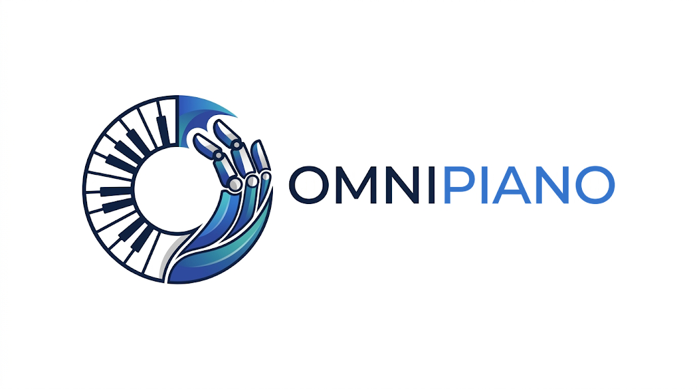
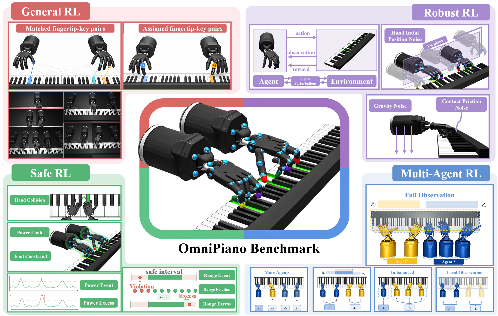

OmniPiano Tutorial
==================

Dexterous robotic manipulation remains a major challenge in robotics, exemplified by piano playing, which requires coordinated control of fingers and arms and provides a demanding testbed for reinforcement learning (RL). Although RoboPianist established a benchmark for robotic piano playing, it is restricted to two hands and does not support unified evaluation.
To address this gap, we introduce OmniPiano, a benchmark that extends RoboPianist from one to up to five Shadow Hands and supports standard, robust, safe, and multi-agent RL within a shared piano-playing task family. OmniPiano is developed for scalable and diverse piano-playing tasks with configurable perturbations, explicit safety constraints, and decentralized cooperation settings. Particularly, to facilitate usability and extendability, OmniPiano adopts a highly modular design and provides comprehensive tasks to support RL study of task performance, robustness, safety, and cooperation in dexterous control. With at least 912 task settings and 36 baseline algorithms, OmniPiano further incorporates LLM-based agents to broaden the evaluation scope and reveal new insights. Extensive evaluations show that state-of-the-art RL algorithms and frontier LLM-based agents still struggle on challenging piano-playing tasks, even under standard RL settings, highlighting substantial room for improvement in dexterous control. The code, dataset, and tutorial are available on the `OmniPiano website <https://omnipiano.site/>`_.

   The overview of OmniPiano Benchmark. A unified benchmark for learning dexterous multi-hand piano playing.

.. toctree::
   :maxdepth: 2
   :caption: Getting Started

   introduction/overview
   introduction/quick_start

.. toctree::
   :maxdepth: 2
   :caption: Environments

   environments/standard
   environments/robust
   environments/safe
   environments/multi_agent

.. toctree::
   :maxdepth: 2
   :caption: Evaluation

   evaluation/cross_framework
   evaluation/sb3
   evaluation/llm_agent
